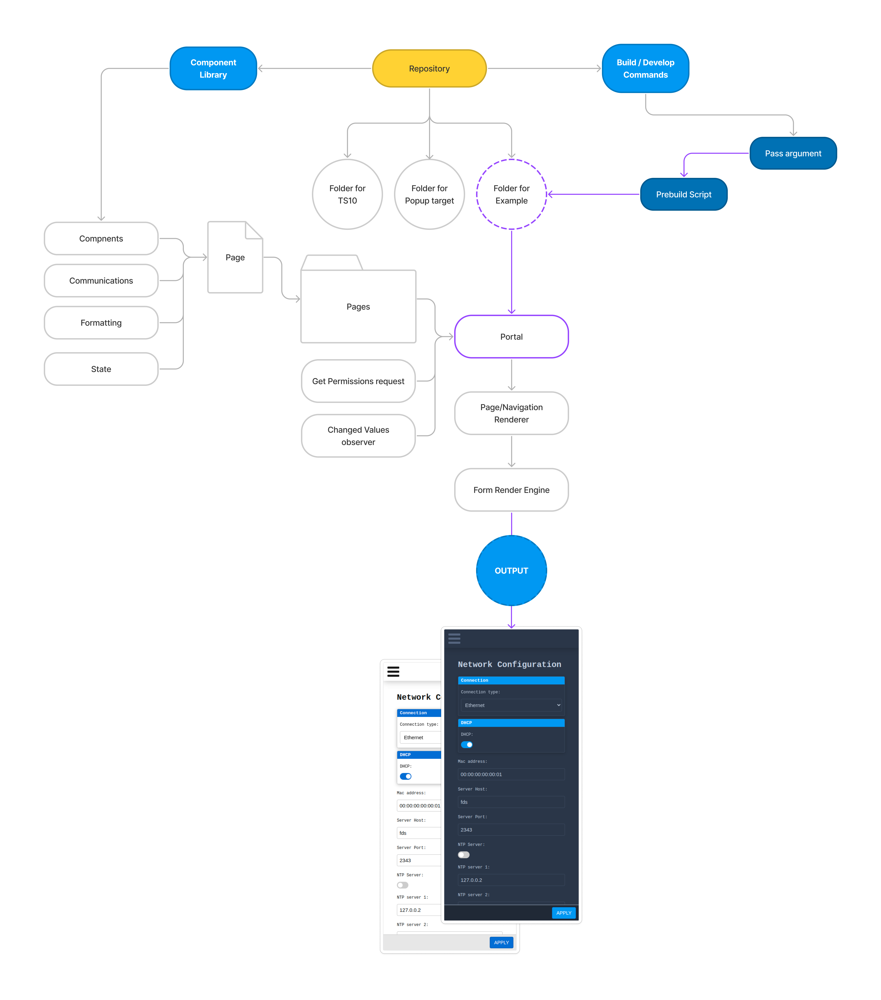
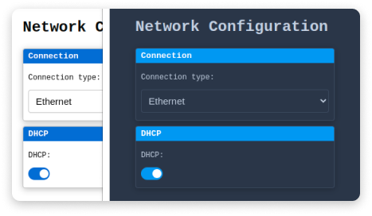

# Configuration Portal Generator

Configuration Portal Generator is a new way to build web based configuration pages for devices. It's a generator that
takes device configurations and converts them into efficient web pages that reuses same components significantly
reducing application size.

## Development

Install dependencies

```bash
  npm i
```

Start Example project in development mode

```bash
  npm run dev --name=Example
```

Production build

```bash
  npm run build --name=Example
```

Serve Production build [locally](http://localhost:8000/)

```bash
  npm run serve-build
```

### Project Overview

All specific builds for all devices is stored in same(this) repository. Separation is achieved with passing arguments in
build/develop commands. When staring project `Example`, all components that is declared for pages are included in final
bundle. There for, fewer components are used, smaller is application size.

Upon develop/build prebuild script creates Slink to corresponding portal
folder ([More about scripts](#more-about-scripts)), so in development environment both files are edditable.



### Example overlook

Example site is generated initially from [Example.store](portals/Example/index.js), there you can
see [Pages](#formatting) object , `getUser`, and `changedValuesStore` [more info](#portal). Endpoint is simulated
with [locally](public/example) stored files. They can be modified if you serve build or by hand in files themselves.

## New Portal creation

Overall description about file structuring and build/dev commands

### Portal

Portal should contain variables `pages`, `getUser`, `changedValuesStore`

- `pages` Array of objects:

  | Key | Value | Description |
  | :-------- | :------- | :------- | 
  | displayName | `string` | Side-menu/Burger navigation display value |
  | Key | `string` | Used for storing local changes |
  | page | [Page](#formatting) object | Page definition to declare expected config and its components, access levels, rendering order |
  | permission |  **optional** `number` | Declare permission level for all page |

- `getUser` Return Currently logged-in user, return should contain `user`:
  *If adding more keys all must be optional*

  | Key | Value | Description |
  | :-------- | :------- | :------- |
  | permission | `number` | Will determine application access level. Some rows will be read-only if access will not suffice, and pages also can be disabled. |


- `changedValuesStore`: svelte `writable` with object with keys corresponding to `pages` array of `key's` and default
  states of `null`, there is util that will generate
  them [createValueStoreFromPages](src/utils/createValueStoreFromPages.js)

### Pages

- Each page should contain `export default page`
- `Apply` button only sends current page config

#### Page

| Key | Value | Description |
| :-------- | :------- | :------- | 
| components | Object | Object with `keys` corresponding to configuration that will be received, `entries`: [Component Details](#component-details)  |
| communications | [Communications](#communications)  object | Each page have its own post and get requests for setting | 
| formatting | [Formatting](#formatting) object | Object can be empty, but if needed holds shared page formatting values, like `title` |
| state | svelte `writable` with default state of `null` | [More info](https://svelte.dev/tutorial/writable-stores)| 
| sections | **optional** array of objects |  Containing array of {`name`: `string`, `keys`: [`string`] }  [Example](#sections-example)|

#### Component Details

| Key | Value | Description |
| :-------- | :------- | :------- |
| component | Svelte Component |  [Available Components](src/components/rows) |
| options | `string[]` | *Only for `Select`component*  Represents display values, actual values are array element index.|
| displayName | **optional** `string` | by default object key will be displayed |
| renderIf | **optional** Object| For conditional redering purposes. Contains object of corresponding `keys` of config and `values` that in case of match will render this component, can be multiple keys and values. In case of various values should be passed as array  |
| permission | **optional** number| Checks if user have permissions for this entry, if not rendered as read-only. Permissions start from `0` as Super-Admin and larger number less permissions user must have |
| props | **optional** [Input Props](https://www.w3schools.com/html/html_form_attributes.asp) | any additional properties that could be passed for input/select component|
| rowExtension | **optional** Svelte Component | component that can be passed in same row, will be located at the end of row. Main purpose to display some status component , icon or button. **Use with caution**  |

#### Communications

- Configs can be sent as single request or [separately](src/utils/sendParamsSeparately.js). Url and will contain config
  key as prefix.
- Sending config would advise using [encodeQueryData](src/utils/encodeQueryData.js) to avoid invalid symbols.
- Requesting config, if they are encoded use [decodeQueryData](src/utils/decodeQueryData.js), it will return true
  decoded values

| Key | Value |  Description |
| :-------- | :------- | :------- |
| apply | Post `request` | that send config of current page|
| getSettings | Get `request` | that returns object of config for current page |

#### Formatting

Current usage is to pass page title.
For future this can be used for custom full pages, footers, headers and/or anything else.
*If adding more keys all must be optional*

| Key | Value | Description |
| :-------- | :------- | :------- | 
| title |  **optional** `string` | Title on top of the each page |

#### Sections example

```javascript
const sections = [
  {name: "Display title", keys: ["keyFromConfig", 'keyFromConfig2', 'keyFromConfig3', 'keyFromConfig4']},
  {name: "Second display title", keys: ['keyFromConfig5', 'keyFromConfig7']}
]
```

### Styling

All styling is done is [global.css](public/global.css)
For colors and element shading use variables (from [theme](#theming) ) . Avoid adding variables for single usage (and overall) to keep it more clean.

#### Theming

Themes are color pallets that allows to recolour application.


Theme selection set in localStorage. Themes assigned in [App file](src/App.svelte). Theme consists from variables used
in [global.css](public/global.css). In case of adding variables, keep files in sync.

### Current limitations

    Todo List of limitations that is not possible

### Further development

Features can be improved and added, but must follow application size, as it should always be light weight. Avoid adding
libraries as to keep builds as lean as possible. If heavy logis is needed for some devices, they should be isolated in
separate components that are included only in expected builds.

### More about scripts

```bash
  npm run {job} --name={name}
```

- job: `build` or `dev`
- name: is based of file name in [portal folder](portals)

*After build encourage checking [build analyze](stats.html) tool, size is not 100% accurate, but you can see if build is
clean not using surplus components and can check over app and component size*

#### Serve

```bash
  npm run serve-build
```

For full application testing `dev` server must be turned off. In `dev` server built in form change detection is disabled (for hot-reload purposes).
In served project its possible to actually edit mocked files (Mock for API calls).